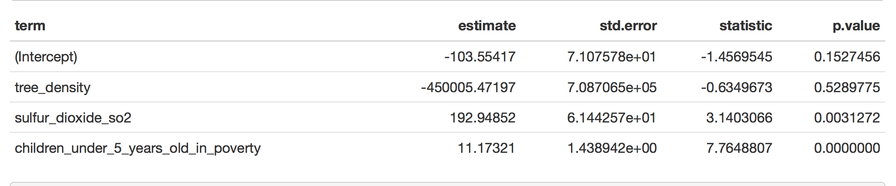

---
output:
  html_document:
   theme: sandstone
   highlight: monochrome
---
##

##Multiple Linear Regression Model

We built two multilinear regression models, investigating the association between asthma rate and tree density, sulfur dioxide SO2 and poverty level for children from 0 to 4 years old and children from 5 to 14 years old.

model one: asthma = -103.55-450005 tree_density +192SO2+ 11.17poverty

model two: asthma = -82.55 -471392 tree_density+ 122SO2+12.87poverty

##

##

The result showed that exposure to air pollution (SO2) (P-value = 0.048, 0.0116) and increased poverty level(p-value = 6.41e-09,2.83e-09) could contribute to excess asthma in urban areas. All the factors are significant except tree density ( p-value = 0.86, 0.64).
