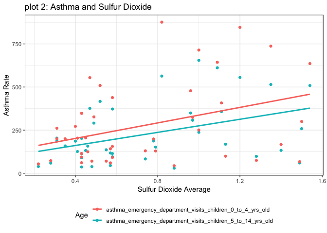
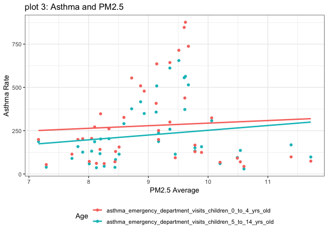
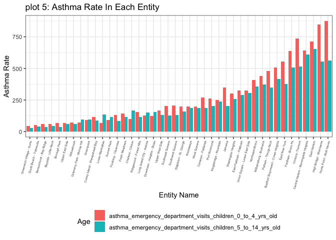
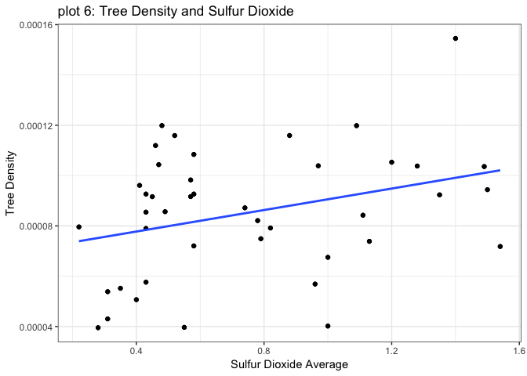
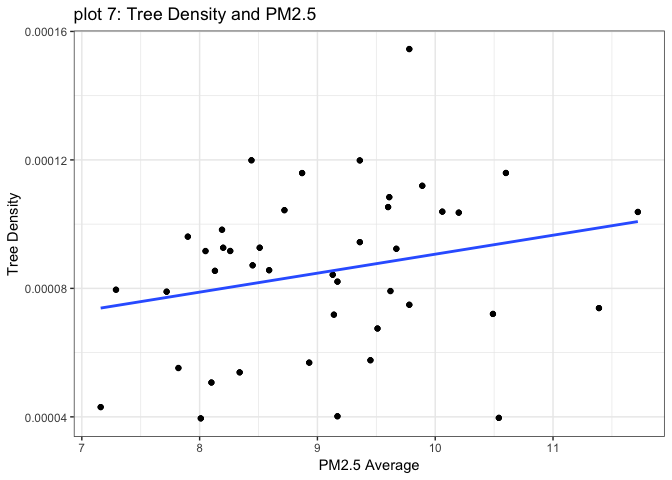

The relationship between Tree density and asthma rate among children in New York City
================
Jingwei Ren (jr3869); Qi Shao (qs2200); Xinyao Wu (xw2598); Baoyi Shi bs3141
12/2/2018

Motivation
----------

Over the past decades, the prevalence of asthma has increased in the urban areas with the potential effects of airflow, air quality and production of aeroallergens. Asthma is the most prevalent chronic disease among children. The disease can make breathing difficult and trigger coughing, wheezing and shortness of breath by the presence of extra mucus in narrow airways.

Data on the influence of green spaces on asthma in children are inconstant.Previous research that did in Kaunas, Lithuania showed a positive association between the level of the surrounding greenness and risk of asthma in children. Their study suggested that high exposure to green spaces may increase the risk of allergic conditions and the prevalence of asthma through the effect of pollen. Another ecological design study did in New York City observed an inverse association between street tree density and the prevalence of asthma. Others have reported no relationships between greenery densities, canopy cover and asthma.

Our goal was to investigate the association between tree densities and asthma among children in New York City, including variables like poverties and air quality factors like fine particulate matter (PM2.5), and ambient concentrations of sulfur dioxide (SO2).

related work
------------

Asthma infection has been an issue for a long time. Inconsistent associations between urban greenery and childhood asthma had stimulated studies on the relations between those two factors. Scientific reviews related to tree densities and asthma rate are here: [Children Living in areas with more street tress have lower prevalence of asthma](https://www.ncbi.nlm.nih.gov/pmc/articles/PMC3415223/), [Associations between neighborhood greenness and asthma in preschool children in Kaunas,Lithuania](https://repository.lsmuni.lt/bitstream/handle/1/1787/27067890.pdf?sequence=1&isAllowed=y) and [Risks and benefits of Green Spaces for children: A Cross-Sectional Study of Associations with Sedentary Behavior, Obesity, Asthma, and Allergy](https://ehp.niehs.nih.gov/doi/10.1289/ehp.1308038).

Initial Questions
-----------------

Our initial questions was whether there is an association between tree densities and asthma among children in New York City based on 42 different neighborhoods.

Furthermore, we investigated the relationships between asthma and other factors, like poverties and air qualities, factors like fine particulate matter (PM2.5), and ambient concentrations of sulfur dioxide (SO2)). We were also interested in the association between tree densities in 42 different neighborhoods and air quality factors.

Data
----

Our GitHub repo of the steps in this analysis can be found [here](https://github.com/Adashaw77/p8105_final_project/blob/master/final.Rmd).

The original tree data includes variables: zip code of each neighborhoods, boroname, tree's diameter, status(alive and dead), health, spc\_common (tree species) and tree's latitude and longitude.

The asthma dataset has a total 16 variables and it includes important variables like neighborhoods, asthma rate for children from 0 to 4 years old and children from 5 to 14 years old, so2 level, poverty percent, percent of the children under 5 years living in the poverty areas, tree's density and total asthma rate.

### Data Source

All data about asthma, poverty and air qualities was retrieved from NYC health (<http://a816-dohbesp.nyc.gov/IndicatorPublic/PublicTracking.aspx>)

All data related to trees was retrieved from NYC open data (<https://data.cityofnewyork.us/Environment/2015-Street-Tree-Census-Tree-Data/pi5s-9p35>)

All neighborhood data was retrieved from[CARTO](https://catharob.carto.com/tables/uhf_42_dohmh_2009/public).

### Scraping method, cleaning

#### Data download link

[Tree data](https://data.cityofnewyork.us/api/views/5rq2-4hqu/rows.csv?accessType=DOWNLOAD)

[UHF42 Zipcoda data](https://raw.githubusercontent.com/BS1125/project_data/master/Zipcode_UHF42.xlsx)

[UHF42 Area data](https://catharob.carto.com/api/v2/sql?filename=uhf_42_dohmh_2009&q=SELECT+*+FROM+(select+*+from+public.uhf_42_dohmh_2009)+as+subq+&format=csv&bounds=&api_key=&skipfields=the_geom_webmercator)

[Asthma, Pollutes and Poverty data](https://raw.githubusercontent.com/BS1125/project_data/master/asthma_pollutes_poverty.csv)

``` r
tree_df = GET("https://data.cityofnewyork.us/api/views/5rq2-4hqu/rows.csv?accessType=DOWNLOAD") %>% 
  content("parsed")

tree_df = tree_df %>%
  janitor::clean_names() %>%
  filter(status == "Alive") %>%
  select(zipcode, latitude, longitude)

download.file("https://raw.githubusercontent.com/BS1125/project_data/master/Zipcode_UHF42.xlsx",mode = "wb",destfile = "Zipcode_UHF42.xlsx")

zipcode_uhf42 = read_excel("Zipcode_UHF42.xlsx") %>%
   gather(key = zipcode_no, value = zipcode, zipcode1:zipcode9) %>%
   select(-zipcode_no, uhf42_name) %>%
   filter(is.na(zipcode) == FALSE)

tree_df = left_join(tree_df, zipcode_uhf42, by = "zipcode") 

download.file("https://catharob.carto.com/api/v2/sql?filename=uhf_42_dohmh_2009&q=SELECT+*+FROM+(select+*+from+public.uhf_42_dohmh_2009)+as+subq+&format=csv&bounds=&api_key=&skipfields=the_geom_webmercator",destfile = "UHF_42.csv")

area = read_csv("UHF_42.csv") %>%
  filter(uhfcode != 0) %>%
  select(uhf42_code = uhfcode, area = shape_area)

tree_df = left_join(tree_df, area, by = "uhf42_code")
```

``` r
#tree density
tree_density = tree_df %>%
  group_by(uhf42_name, uhf42_code, area) %>%
  dplyr::summarize(tree_total = n()) %>%
  filter(is.na(uhf42_name) == FALSE) %>%
  group_by(uhf42_name) %>%
  dplyr::mutate(tree_density = tree_total/area) %>%
  ungroup() %>%
  mutate(uhf42_name = forcats::fct_reorder(uhf42_name, tree_density))
```

``` r
#read and tidy data
download.file("https://raw.githubusercontent.com/BS1125/project_data/master/asthma_pollutes_poverty.csv",mode = "wb",destfile = "asthma_air_poverty.csv")
```

Exploratory analysis:
---------------------

### Asthma Visualizations

### Step one

``` r
#plot between asthma and tree
final_asthma_df = gather(final_df, key = asthma_age, value = rate, asthma_emergency_department_visits_children_0_to_4_yrs_old:asthma_emergency_department_visits_children_5_to_14_yrs_old) %>%
  gather(key = poverty_age, value = poverty, poverty:children_under_5_years_old_in_poverty) %>%
  filter((asthma_age == "asthma_emergency_department_visits_children_5_to_14_yrs_old"&poverty_age == "poverty")|(asthma_age == "asthma_emergency_department_visits_children_0_to_4_yrs_old"& poverty_age == "children_under_5_years_old_in_poverty"))

#plot between tree and astham rate
ggplot(final_asthma_df) +
  geom_point(aes(x = tree_density, y = rate, color = asthma_age)) +
   geom_smooth(aes(x = tree_density, y = rate, color = asthma_age), method = "lm",se = F) +
   labs(
    title = "plot 1: Asthma and Tree Density",
    x = "Tree Density",
    y = "Asthma Rate"
  ) +
   theme(legend.position = "bottom") +
   guides(color = guide_legend(nrow = 2)) +
   scale_color_hue(name = "Age")
```


Plot1 showed the relationship between children asthma rate and tree densities for children from 0 to 4 years old and for children from 5 to 14 yeras old. Visually, there was a slightly positive association between tree density and astham rate. Children who are younger have a relatively higher asthma rate compared to children who are older.

### Step two

Other factors may also impact the astham rate. We made plots showing the association between astham and air qualities (fine particulate matter (PM2.5), and ambient concentrations of sulfur dioxide (SO2) ) and the association between asthma and poverty rate.

``` r
#plot between asthma and so2
ggplot(final_asthma_df) +
   geom_point(aes(x = sulfur_dioxide_so2, y = rate, color = asthma_age))+
   geom_smooth(aes(x = sulfur_dioxide_so2, y = rate, color = asthma_age), method = "lm", se = F) +
   labs(
    title = "plot 2: Asthma and Sulfur Dioxide",
    x = "Sulfur Dioxide Average",
    y = "Asthma Rate"
  ) +
   theme(legend.position = "bottom") +
   guides(color = guide_legend(nrow = 2)) +
   scale_color_hue(name = "Age")
```



``` r
# plot asthma and pm2.5
ggplot(final_asthma_df) +
   geom_point(aes(x = fine_particulate_matter_pm2_5, y = rate, color = asthma_age))+
   geom_smooth(aes(x = fine_particulate_matter_pm2_5, y = rate, color = asthma_age), method = "lm", se = F) +
   labs(
    title = "plot 3: Asthma and PM2.5",
    x = "PM2.5 Average",
    y = "Asthma Rate"
  ) +
   theme(legend.position = "bottom") +
   guides(color = guide_legend(nrow = 2)) +
   scale_color_hue(name = "Age")
```



``` r
# plot between asthma and poverty
ggplot(final_asthma_df) +
   geom_point(aes(x = poverty, y = rate, color = asthma_age))+
   geom_smooth(aes(x = poverty, y = rate, color = asthma_age), method = "lm", se = F) +
   labs(
    title = "plot 4: Asthma and Poverty",
    x = "Poverty Percent",
    y = "Asthma Rate"
  ) +
   theme(legend.position = "bottom") +
   guides(color = guide_legend(nrow = 2)) +
   scale_color_hue(name = "Age")
```


plot2 showed the relationship between asthma rate and so2. plot3 showed the relationship between astham rate rate and pM.25 plot4 showed the relationship between asthma and poverty. Visually, there was a respective positive association between asthma rate and SO2, PM 2.5 and poverty level.

### Step three

We are interested in seeing whether asthma rate is different between children from 0 to 4 years old and children from 5 to 14 years old in 42 neighborhoods in new york city.

``` r
#plot between asthma 0-4 and asthma 5-14 in each UHF42
ggplot(final_asthma_df) +
  geom_bar(aes(x = geo_entity_name, y = rate, fill = asthma_age), stat = "identity", position = "dodge") +
   labs(
    title = "plot 5: Asthma Rate In Each Entity",
    x = "Entity Name",
    y = "Asthma Rate"
  ) +
   theme(legend.position = "bottom", axis.text.x = element_text(size = 4.5,angle = 75, hjust = 1)) +
   guides(fill = guide_legend(nrow = 2)) +
   scale_fill_hue(name = "Age") 
```



Plot 5 showed that children from 0 to 4 years have higher asthma rate compared to children from 5 to 14 years old. Hunts point\_ Mott Haven has the highest asthma rate for children from 0 to 4 years old. East Harlem has the highest asthma rate for children from 5 to 14 years old. The plot also showed that children from 0 to 4 years have higher asthma rate compared to children from 5 to 14 years old.

Three Visualizations
--------------------

Based on the association we found between air quality and asthma as well as the association between tree density and asthma, we then desired to explore the relationship between tree density and air quality factors.

``` r
#plot between tree and SO2
ggplot(final_asthma_df) +
  geom_point(aes(x = sulfur_dioxide_so2, y = tree_density)) +
  geom_smooth(aes(x = sulfur_dioxide_so2, y = tree_density), method = "lm", se = F) +
   labs(
    title = "plot 6: Tree Density and Sulfur Dioxide",
    x = "Sulfur Dioxide Average",
    y = "Tree Density"
  ) 
```



``` r
#plot between tree and pm2.5
ggplot(final_asthma_df) +
  geom_point(aes(x = fine_particulate_matter_pm2_5, y = tree_density)) +
  geom_smooth(aes(x = fine_particulate_matter_pm2_5, y = tree_density), method = "lm", se = F) +
   labs(
    title = "plot 7: Tree Density and PM2.5",
    x = "PM2.5 Average",
    y = "Tree Density"
  ) 
```



As the previous figure showed that So2 and pm2.5 has a strong positive association with asthma, we chose So2 and pm2.5 respectively as our factor then made a scatter plot and added an adjusted regression line to visualize the relationship. plot 6 showed the association between tree density and so2. plot 7 showed the association between tree density and pm 2.5 Visually, there was a positive association between tree density and air quality factors.As the SO2 level in one area increases, its tree density also increases. As PM 2.5 level in one area increases, its tree density also increases.

Statistical analyses
--------------------

Based on the fact that tree density as well as air quality both have obvious effects on children asthma rate, we tried math method to prove our finding. We built two multilinear regression models, investigating the association between asthma rate and tree density, sulfur dioxide SO2 and poverty level for children from 0 to 4 years old and children from 5 to 14 years old. We assumed no interactions existed between each variable.

``` r
# mlr showing the relationship between asthma rate of kids from 0 to 4 years and tree density, so2 levels, percent of the children under 5 years living in the poverty areas
summary(lm(asthma_emergency_department_visits_children_0_to_4_yrs_old~tree_density+sulfur_dioxide_so2+children_under_5_years_old_in_poverty,data=final_df)) %>%
  broom::tidy() %>%
  knitr::kable()
```

| term                                        |      estimate|     std.error|   statistic|    p.value|
|:--------------------------------------------|-------------:|-------------:|-----------:|----------:|
| (Intercept)                                 |    -155.24310|  9.011553e+01|  -1.7227119|  0.0930711|
| tree\_density                               |  163130.32364|  9.415070e+05|   0.1732651|  0.8633627|
| sulfur\_dioxide\_so2                        |     189.68311|  6.276371e+01|   3.0221782|  0.0044754|
| children\_under\_5\_years\_old\_in\_poverty |      11.07405|  1.489616e+00|   7.4341612|  0.0000000|

``` r
# mlr howing the relationship between asthma rate of kids from 5 to 14 years and tree density, so2 levels, poverty levels

summary(lm(asthma_emergency_department_visits_children_5_to_14_yrs_old~tree_density+sulfur_dioxide_so2+poverty,data=final_df)) %>%
  broom::tidy() %>%
  knitr::kable()
```

| term                 |       estimate|     std.error|   statistic|    p.value|
|:---------------------|--------------:|-------------:|-----------:|----------:|
| (Intercept)          |      -88.28305|  6.421422e+01|  -1.3748207|  0.1772400|
| tree\_density        |  -414020.33134|  6.693588e+05|  -0.6185327|  0.5399144|
| sulfur\_dioxide\_so2 |      122.53171|  4.567335e+01|   2.6827835|  0.0107495|
| poverty              |       12.90333|  1.683991e+00|   7.6623505|  0.0000000|

The multiple linear regression models show all the factors are significant except tree density ( p value is 0.86, 0.64). This indicated that there are associations between asthma rate of kids and so2 and poverty levels.

model one: asthma = -103.55-450005 tree\_density +192SO2+ 11.17poverty model two: asthma = -82.55 -471392 tree\_density+ 122SO2+12.87poverty

Additional analysis
-------------------

For a intuitive sence, people will strongly believe that better air quality will lead to less asthnma rate. Since we have the data included other kinds of air pollution related level and asthma rate, we used math method(SLR) to figure out whether other factors may have influences on asthma rate.

We tested the association between astham rate and all pollutes including ozone, black carbon, PM 2.5, NO, NO2, SO2.

``` r
#SLR:choose the pollutes associated with asthma
o3_p1 = summary(lm(asthma_emergency_department_visits_children_0_to_4_yrs_old~ozone_o3, data=final_df))$coefficients[2,4]

o3_p2 = summary(lm(asthma_emergency_department_visits_children_5_to_14_yrs_old~ozone_o3, data=final_df))$coefficients[2,4]

black_carbon_p1 = summary(lm(asthma_emergency_department_visits_children_0_to_4_yrs_old~black_carbon, data=final_df))$coefficients[2,4]

black_carbon_p2 = summary(lm(asthma_emergency_department_visits_children_5_to_14_yrs_old~black_carbon, data=final_df))$coefficients[2,4]

pm2_5_p1 = summary(lm(asthma_emergency_department_visits_children_0_to_4_yrs_old~fine_particulate_matter_pm2_5, data=final_df))$coefficients[2,4]

pm2_5_p2 = summary(lm(asthma_emergency_department_visits_children_5_to_14_yrs_old~fine_particulate_matter_pm2_5, data=final_df))$coefficients[2,4]

no_p1 = summary(lm(asthma_emergency_department_visits_children_0_to_4_yrs_old~nitric_oxide_no, data=final_df))$coefficients[2,4]

no_p2 = summary(lm(asthma_emergency_department_visits_children_5_to_14_yrs_old~nitric_oxide_no, data=final_df))$coefficients[2,4]

no2_p1 = summary(lm(asthma_emergency_department_visits_children_0_to_4_yrs_old~nitrogen_dioxide_no2, data=final_df))$coefficients[2,4]

no2_p2 = summary(lm(asthma_emergency_department_visits_children_5_to_14_yrs_old~nitrogen_dioxide_no2, data=final_df))$coefficients[2,4]

so2_p1 = summary(lm(asthma_emergency_department_visits_children_0_to_4_yrs_old~sulfur_dioxide_so2, data=final_df))$coefficients[2,4]

so2_p2 = summary(lm(asthma_emergency_department_visits_children_5_to_14_yrs_old~sulfur_dioxide_so2, data=final_df))$coefficients[2,4]

data.frame(Pollute = c("Ozone", "Black Carbon", "PM2.5", "NO", "NO2", "SO2"),
                     P_value1 = c(o3_p1, black_carbon_p1, pm2_5_p1, no_p1, no2_p1, so2_p1),
                     P_value2 = c(o3_p2, black_carbon_p2, pm2_5_p2, no_p2, no2_p2, so2_p2)) %>%
  knitr::kable(digits = 3)
```

| Pollute      |  P\_value1|  P\_value2|
|:-------------|----------:|----------:|
| Ozone        |      0.828|      0.380|
| Black Carbon |      0.551|      0.242|
| PM2.5        |      0.676|      0.298|
| NO           |      0.507|      0.868|
| NO2          |      0.738|      0.347|
| SO2          |      0.017|      0.006|

``` r
#based on p values, we choose SO2
```

The result showed that only SO2 had an association with asthma, since the p value is lower than 0.05. All the other air quality factors are not significantly related to children asthma rate.

We did a paired T test to test if there is significant difference between asthma rate of 0-4 and that of 5-14.

``` r
#Paired T test to test if there is significant difference between asthma rate of 0-4 and that of 5-14
t.test(final_df$asthma_emergency_department_visits_children_0_to_4_yrs_old, final_df$asthma_emergency_department_visits_children_5_to_14_yrs_old, paired=T) %>%
  broom::tidy() %>%
  knitr::kable()
```

|  estimate|  statistic|    p.value|  parameter|  conf.low|  conf.high| method        | alternative |
|---------:|----------:|----------:|----------:|---------:|----------:|:--------------|:------------|
|  53.06667|   4.257839|  0.0001173|         41|  27.89655|   78.23679| Paired t-test | two.sided   |

The T test result showed that there is significant difference between children asthma rate of 0-4 and that of 5-14. P value is 2.11e-05, lower than 0.05.

Discussion
----------

Our main goal is to discuss the relationship between tree density in New York City and children asthma rate in 2015. We built two multilinear regression models, investigating the relationship between asthma rate and tree density, SO2 and poverty level for children from 0 to 4 years old and children from 5 to 14 years old. The result showed that exposure to air pollution (SO2) (P-value = 0.048, 0.0116) and increased poverty level(p-value = 6.41e-09,2.83e-09) could contribute to excess asthma in urban areas. All the factors are significant except tree density ( p-value = 0.86, 0.64).

We listed some possible reasons that explained why no obvious association was shown between tree density and asthma. One possible explanation is the season. In the spring and summer months, increasing tree densities might have a positive impact on asthma rate. Pollen could be an allergen that gives some people sneezing fits and watery eyes, which could indirectly cause an asthma attack in others. Certain trees like Ash, Birch, and Oak could cause aggravate respiratory allergies. However, in the fall and winter months, increasing tree densities might decrease the asthma rate through the effect on local air quality. Those two situations might counteract each other and result in the conclusion that overall, there was no association between tree density in New York City and children asthma rate in 2015. Other factors might also influence the asthma rate, including sociodemographic characteristics, population density and hospitals amount in the neighborhood. After adjustment, the association between tree density and hospitalizations as a result of asthma might no longer significant.

We were also interested to see whether there was a difference in asthma rate between children from 0 to 4 years old and children from 5 to 14 years old. The result from plot 5 showed that children from 0 to 4 years have a higher asthma rate compared to children from 5 to 14 years old. The T-test also proved that there is a significant difference between children asthma rate of 0-4 and that of 5-14. (P value = 2.11e-05). A positive relationship between tree density and air quality factors in 42 neighborhood in New York city was reported. Tree density increases as CO2 and PM 2.5 levels increase. One possible explanation for this could be that people's awareness of environment increases as the air quality in one area decreases. Therefore, we saw a positive result. We would expect to see a negative association. In order to verify this, we could make plots detecting the change of air quality's levels throughout a couple of years. Increasing tree densities might help to decrease air quality's levels through a long-term process.

In conclusion, we found out that there is no association between tree density and asthma rate based on our data set. If more variables are included in the future, we would expect to see that afforestation in low-income communities will help improve air-quality and thus decrease the risk of child asthma over a long-term period

Reference
---------

(1)Lovasi, G. S., Quinn, J. W., Neckerman, K. M., Perzanowski, M. S., & Rundle, A. (2008). Children living in areas with more street trees have lower prevalence of asthma. Journal of Epidemiology & Community Health, 62(7), 647-649. <doi:10.1136/jech.2007.071894>

(2)Andrusaityte, S., Grazuleviciene, R., Kudzyte, J., Bernotiene, A., Dedele, A. and Nieuwenhuijsen, M. (2016). Associations between neighbourhood greenness and asthma in preschool children in Kaunas, Lithuania: a case–control study. BMJ Open, 6(4), p.e010341.

(3)Dadvand, Payam, et al. “Risks and Benefits of Green Spaces for Children: A Cross-Sectional Study of Associations with Sedentary Behavior, Obesity, Asthma, and Allergy.” Environmental Health Perspectives, vol. 122, no. 12, 2014, pp. 1329–1335., <doi:10.1289/ehp.1308038>.
