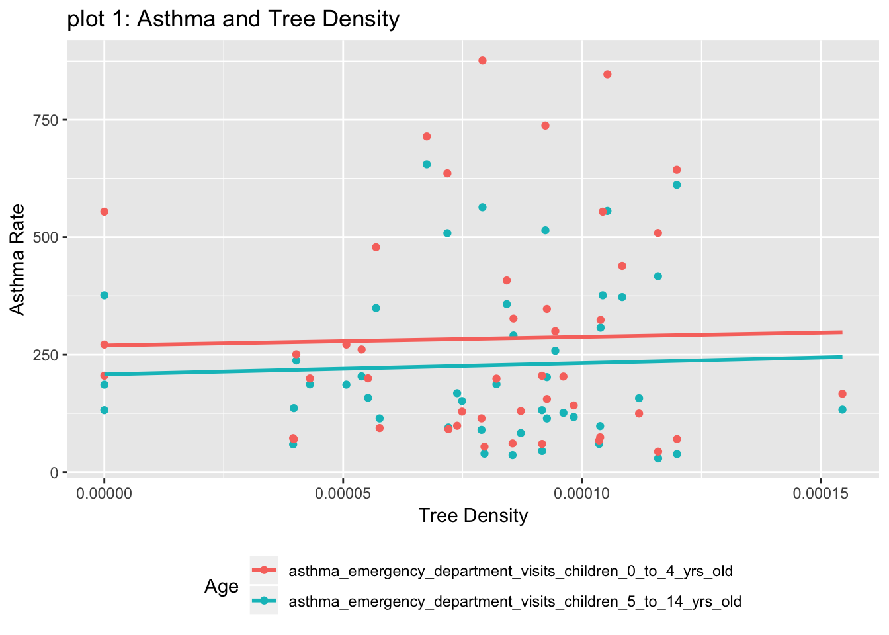
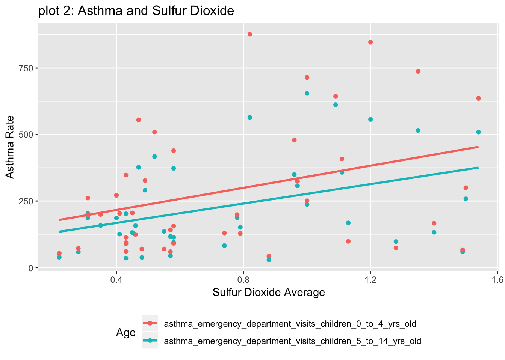
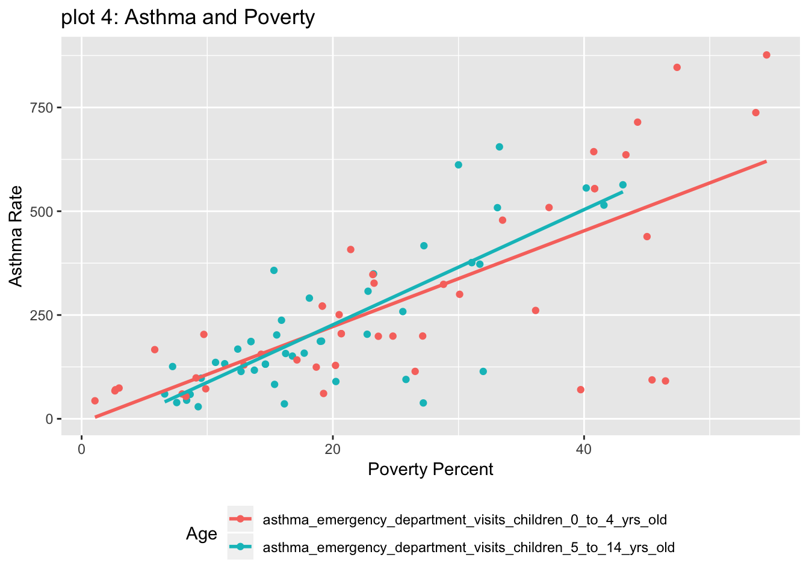

---
output:
  html_document:
   toc: true
   toc_float: true
   theme: sandstone
   highlight: monochrome
---
 with asthma among children in New York City
------------------------------------------------------------

# Motivation

   Over the past decades, the prevalence of asthma has increased in the urban areas with the potential effects of airflow, air quality and production of aeroallergens. Asthma is the most prevalent chronic disease among children. The disease can make breathing difficult and trigger coughing, wheezing and shortness of breath by the presence of extra mucus in narrow airways. Data on the influence of green spaces on asthma in children are inconstant. Previous research that did in Kaunas, Lithuania showed a positive association between the level of the surrounding greenness and risk of asthma in children. Their study suggested that high exposure to green spaces may increase the risk of allergic conditions and the prevalence of asthma through the effect of pollen. Another ecological design study did in New York City observed an inverse association between street tree density and the prevalence of asthma. Others have reported no relationships between greenery densities, canopy cover and asthma.

Our goal was to investigate the association between tree densities and asthma among children in New York City, including variables like poverties and air quality factors like fine particulate matter (PM2.5), and ambient concentrations of sulfur dioxide (SO2).

# Data source

  All data about asthma, poverty and air qualities was retrieved from NYC health (http://a816-dohbesp.nyc.gov/IndicatorPublic/PublicTracking.aspx)

  All data related to trees was retrieved from NYC open data (https://data.cityofnewyork.us/Environment/2015-Street-Tree-Census-Tree-Data/pi5s-9p35)

  All neighborhood data was retrieved from (http://www.infoshare.org/misc/UHF.pdf)

# What we found

##tree density vs astham rate

 shows the assoication between tree density and astham rate among different age groups of children in New York City. __Even though__

##SO2 vs astham rate

Figure 2. shows the assoication between SO2 and astham rate among different age groups of children in New York City. __Even though__

## poverty vs astham rate

Figure 3.shows the assoication between poverty level and astham rate among different age groups of children in New York City. __Even though__

